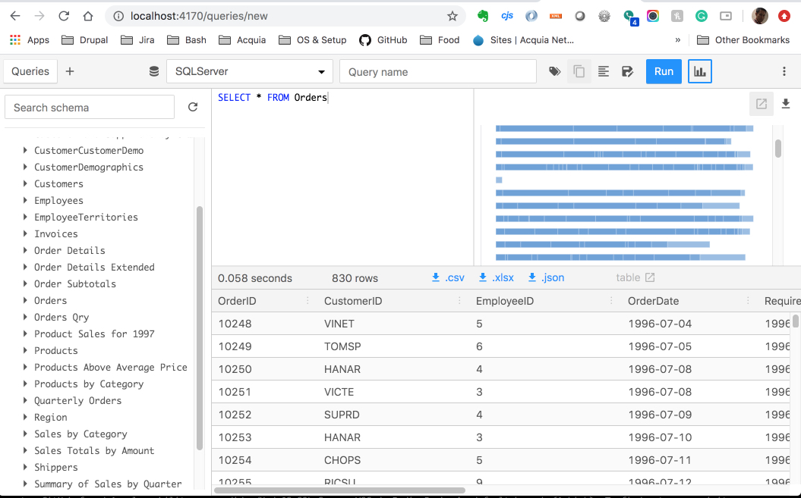
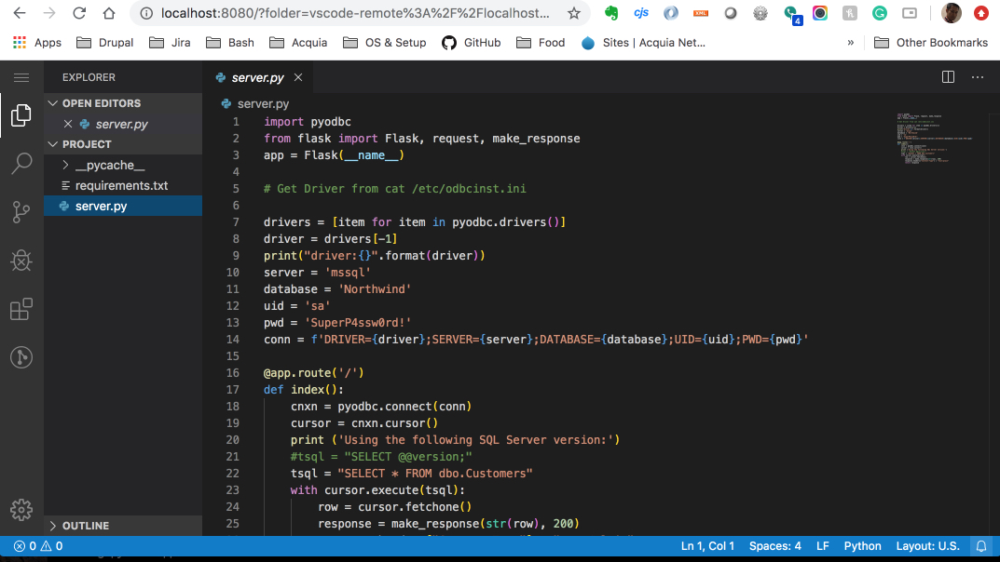

# Python SQL Server Docker with VSCode
Python SQL Server Docker with Vscode

SQLPad - SQL Server Admin Client

VSCode - Online IDE

#### Install
`docker-compose up -d`

Python Endpoint: `http://localhost:6650/`

VSCode: `http://localhost:8080/`

Password: `skybird`

SQL Server Admin: `http://localhost:4170`

Email: `admin@admin.com`

Pass: `12345`

Create a DB Connection if the list is empty. 

Host: `mssql`, Database: `Northwind`, Database Username: `sa`, Database Password: `SuperP4ssw0rd!`

